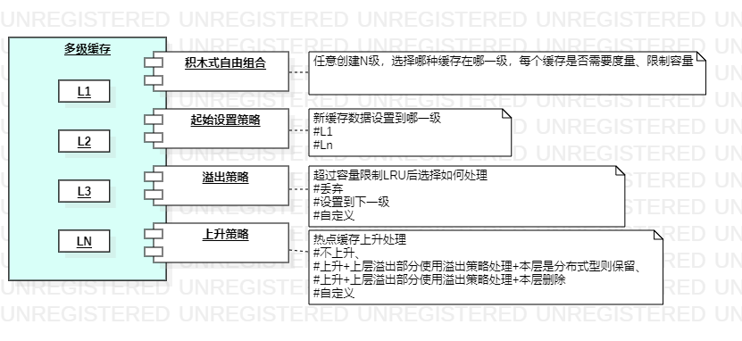
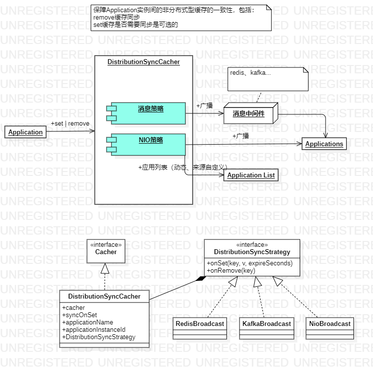

# 概览

wing是一个具有保护、同步等特性的多级缓存框架

# 架构


# 多种内置缓存


* 堆内内存
* 直接内存
* redis缓存

# 多级缓存



# 过载保护


# 缓存同步策略



# 如何使用

## Maven依赖
```xml
<dependency>
	<groupId>io.github.icodegarden</groupId>
	<artifactId>wing-core</artifactId>
	<version>最新版本可在maven中央仓库找到</version>
</dependency>
```

## 创建Cacher

### 堆内内存缓存
```java
Cacher cacher = new HeapMemoryCacher();
```

### 直接内存缓存
```java
Cacher cacher = new ReuseableDirectMemoryCacher();//回收的内存空间可复用，有利于提升性能，但需要的整体内存空间需要更大一些
Cacher cacher = new DefaultDirectMemoryCacher(); //常规方式
```

### redis缓存
```java
//以下任选其一
Cacher cacher = RedisCacher.jedisCluster(jc);
Cacher cacher = RedisCacher.jedisPool(jp);
Cacher cacher = RedisCacher.redisTemplate(rt);
```

### 自动过期缓存
```java
Cacher cacher = new AutoExpireCacher(任意cacher);//适用于堆内、直接内存缓存，redis则由它自己管理不需要这么做
```

### key数量限制的缓存
```java
//推荐对HeapMemoryCacher、DirectMemoryCacher设置
long maxKeySizeOfHeap = 10000;
Cacher cacher = new KeySizeLRUCacher(new KeySizeMetricsCacher(new AutoExpireCacher(任意cacher)), maxKeySizeOfHeap);
```

### key数量限制的缓存
```java
//推荐对DirectMemoryCacher设置，HeapMemoryCacher不支持，因为计算空间需要序列化，而HeapMemoryCacher为此会牺牲性能
long maxBytesOfDirect = 100 * _1MB;
Cacher cacher = new AutoExpireCacher(new SpaceSizeLRUCacher(new SpaceMetricsCacher(cacher), maxBytesOfDirect));
```

### 多级缓存
```java
//创建多级缓存可以自定义随意组合，也可以直接使用下面的builder创建一个三级缓存
Cacher cacher = UsageBuilder.redisOfL3BasedOnHeapAndDirectBuilder().redisCacher(redisCacher)
				.serializer(serializer).deserializer(deserializer).maxKeySizeOfHeap(1000).maxBytesOfDirect(2048000)
				.upgradeMinUsedTimes(5).build();
```

# Cacher API


